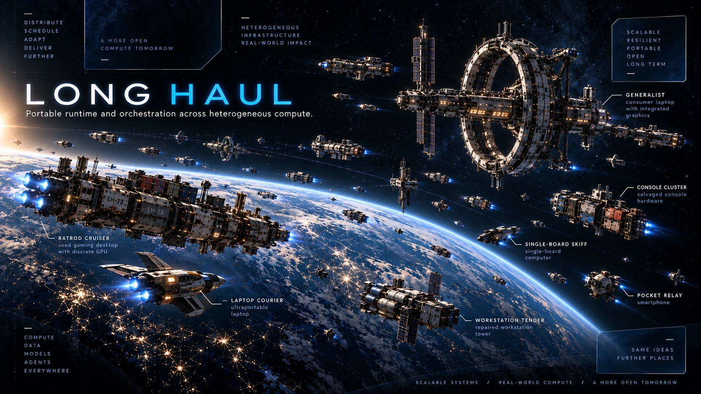

# Long Haul

[](https://github.com/pH34r-pH/long-haul/actions/workflows/ci.yml)
[](LICENSE)

<p align="center">
  
</p>

**Topology-aware orchestration for heterogeneous local inference crews.**

Long Haul is a hardware-agnostic runtime and research framework for coordinating persistent crew identities, model/runtime embodiments, and mismatched compute resources across local and networked vessels.

It is built around a simple constraint: **real hardware is not a uniform pool, and reliable multi-agent engineering is not just prompt delegation**.

## What Long Haul models

- **Crew members** — persistent operational identities with roles, authority, competence history, and continuity.
- **Embodiments** — the current model/runtime/vessel/resource combination implementing a crew member.
- **Vessels and resources** — normalized physical hosts and individually addressable CPU/GPU/NPU/memory/storage capabilities.
- **Measured links** — topology, bandwidth, latency, and transport evidence.
- **Missions and work contracts** — objectives with explicit scope, capabilities, budgets, and external success/failure predicates.
- **Execution plans** — mappings from work to crew, resources, runtimes, and execution modes.
- **Evidence** — replayable events, independent acceptance packets, checkpoints, and outcome history.

Model size does not confer authority. Aggregate RAM/VRAM is not treated as uniform capacity. A worker saying “done” is not acceptance evidence.

## Research question

The first experiment asks whether a dissent-preserving, competence-scoped two-member scheduler can outperform simpler deterministic, single-planner, or master/subagent baselines under matched compute and task constraints.

The experiment preserves independent initial judgments, measures coordination cost, and evaluates plan feasibility, task success, performance, calibration, disagreement, and regret. See [the experiment plan](docs/experiments.md).

## Architecture

```text
discovery + benchmarks -> normalized topology -> candidate plans
                                                |
                              independent crew positions
                                                |
                                         decision protocol
                                                |
                                           execution
                                                |
                                outcome + evidence + events
```

Execution modes are `LOCAL`, `POOL`, `PIPELINE`, and `COMPOSE`. Runtime strategies such as resident, offloaded, split, or streaming execution are described by validated inference profiles rather than overloaded into those modes.

Read [Architecture](docs/architecture.md), the detailed [North-Star Architecture](docs/north-star.md), the [repository map](docs/repository-map.md), or the [Wiki](https://github.com/pH34r-pH/long-haul/wiki).

## Public runtime, private Fleet

This repository owns portable runtime code, schemas, tests, reference infrastructure, and qualification contracts.

The separate private Fleet control plane owns concrete machines, privileged Azure/network state, self-hosted runners, protected promotion/rollback, and private hardware evidence. Fleet consumes exact public revisions; public pull-request code does not automatically cross the privilege boundary.

See [repository boundary](docs/repository-boundary.md) and [exact-source Fleet handoff](docs/fleet-source-contract.md).

## Repository map

- `src/long_haul/` — runtime implementation.
- `contracts/` — durable machine-readable contracts.
- `crew/` — public crew/fixture definitions.
- `tests/` — behavior and contract tests.
- `docs/` — authoritative architecture, experiment, requirement, and validation documents.
- `docs/repository-map.md` and scoped `AGENTS.md` files — contributor maps with change routing and focused validation commands.
- `docs/wiki/` — canonical source for the GitHub Wiki.
- `infra/azure/` — public reference infrastructure only.
- `scripts/`, `tools/` — packaging and validation helpers.

## Development

Use the pinned repository environment (`pyproject.toml`, `uv.lock`, and the checked-in `devenv` definition) rather than copying tool versions from old notes. Run the repository CI-equivalent tests before submitting changes.

Read [CONTRIBUTING.md](CONTRIBUTING.md) before opening a pull request.

## Security, citation, and license

Report sensitive problems according to [SECURITY.md](SECURITY.md). Research use can cite [CITATION.cff](CITATION.cff).

Licensed under Apache-2.0. See [LICENSE](LICENSE) and [NOTICE](NOTICE).


## Research publication boundary

Long Haul owns runtime/scheduler/reusable-system semantics; source-owned experiment science stays in the existing research/evidence pipeline. Experiment Compiler provides exact portable experiment identity and `experiments.tyharbin.com` provides the live inspect/verify/reproduce surface.

When a study is deliberately finalized for archival publication, the source owner may promote the **exact reviewed finalized bytes** to [pH34r-pH/compiled-experiments](https://github.com/pH34r-pH/compiled-experiments). That repository preserves immutable release lineage and hands a human-reviewed GitHub Release to Zenodo for DOI archival. Long Haul does not mint DOIs, rebuild archived packages, or treat archive/DOI presence as scientific or production qualification.

Cross-repository integration is tracked in [compiled-experiments#1](https://github.com/pH34r-pH/compiled-experiments/issues/1).
