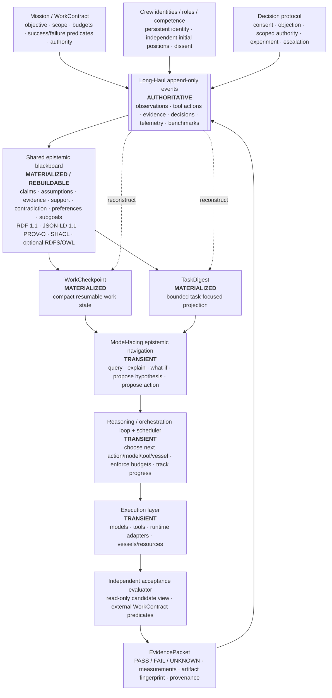
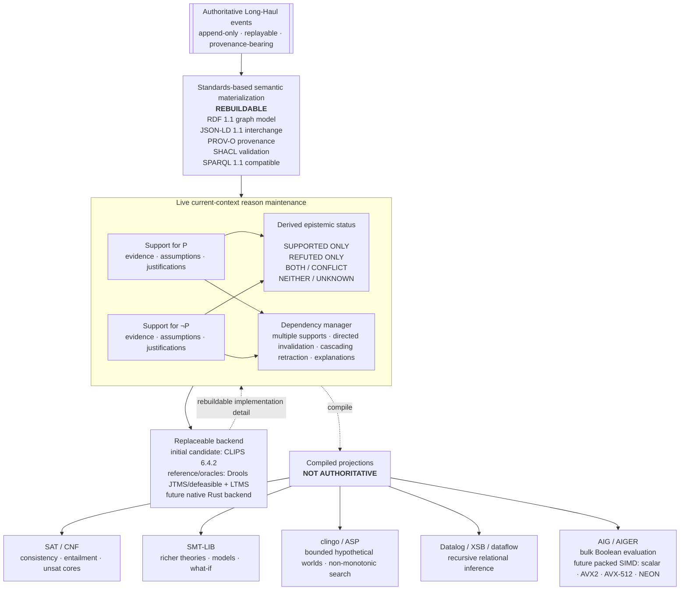
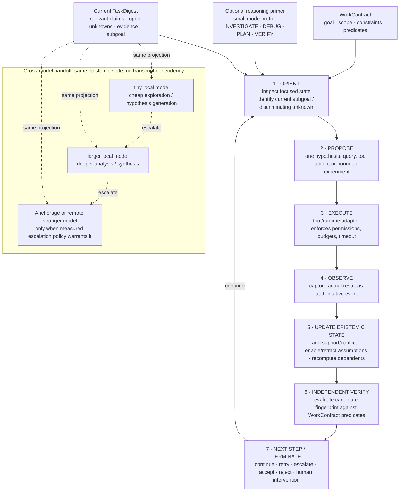
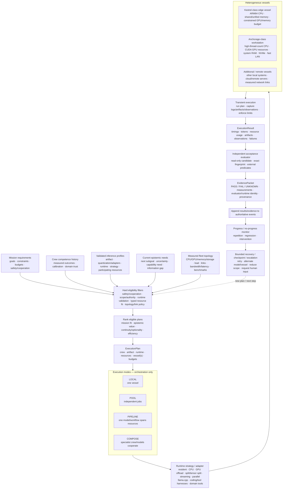

# Long-Haul north-star architecture

> Status: design north star, 2026-09-29. This document records the intended architectural direction and the boundaries we want to preserve while the implementation evolves. It is not a claim that every component shown here is implemented today.

Long-Haul is converging on a standards-first blackboard/KRR architecture for persistent work across heterogeneous models and hardware. The authoritative state remains the append-only event log. Shared epistemic state, checkpoints, solver encodings, and model context are all rebuildable projections. Models participate as transient clients that propose hypotheses and actions; they do not own canonical institutional or epistemic state.

Related roadmap and design work: #5, #19, #59-#66, #118, #120, #130-#141, and top-level roadmap #136.

## 1. End-to-end north star

### Core invariants

- The event log is the source of truth.
- Model sessions are disposable.
- Epistemic state is rebuildable from authoritative history.
- A model saying “done” is never acceptance evidence.
- Crew identity is independent of model checkpoint, process, embodiment, and session.
- Truth semantics and navigation policy are separate concerns.
- Heterogeneous resources are scheduled from measured topology and validated inference profiles, never fictitious aggregate capacity.
- Durable reasoning state stores claims, evidence, derivations, contradictions, decisions, actions, and outcomes, not unbounded private chain-of-thought.

## 2. Epistemic kernel / reason-maintenance

The intended “kernel” is deliberately small. Standards own representation and provenance; a replaceable reason-maintenance backend owns current-context dependency maintenance; specialized solvers receive compiled projections.

### Reason-maintenance semantics

For a proposition (P), positive and negative support are maintained independently. Contradiction is preserved and localized instead of “resolved” by silently deleting one side.

| Support for P | Support for ¬P | Model-facing status |
| --- | --- | --- |
| yes | no | supported only |
| no | yes | refuted only |
| yes | yes | both / conflict |
| no | no | neither / unknown |

This permits paraconsistent behavior at the Long-Haul semantic layer while keeping the live dependency engine simple and replaceable.

### Backend strategy

The current research direction is:

1. **CLIPS 6.4.2** as the first small embedded backend candidate for logical support, multiple justifications, dependency inspection, and automatic retraction.
2. **Drools/KIE JTMS + defeasible belief systems** as a mature semantic/conformance reference.
3. **LTMS** as a readable textbook-style oracle for JTMS/LTMS/ATMS behavior.
4. **SAT/SMT/ASP** for bounded hypothetical contexts instead of forcing every possible world into the live TMS.
5. **AIG/AIGER** for an optimized Boolean projection, eventually backed by native packed/SIMD evaluation.
6. No backend-private IDs, clauses, or graph objects become durable Long-Haul domain identity.

See #130, #131, #132, #138, and #139.

## 3. Tiny-model reasoning and session lifecycle

Long-Haul should externalize the temporal structure that tiny models struggle to maintain internally. Each invocation receives a focused view of shared state and performs one bounded transition.

### Separation of truth and navigation

**Truth semantics** answer:
- What is supported, refuted, both, or unknown?
- What depends on what?
- What changed when an assumption was retracted?
- What evidence supports this conclusion?

**Navigation policy** answers:
- Which unknown is worth investigating next?
- Which observation would discriminate among live hypotheses?
- Which model/tool/vessel should perform that investigation?
- Is escalation worth the additional latency, memory, or cost?

Navigation may eventually be learned. It must never silently rewrite truth semantics. See #133, #134, #140, and #141.

## 4. Fleet execution, hardware, and evidence loop

Execution remains topology-aware and model/runtime-neutral. Execution modes describe orchestration; resident/offloaded/split/streaming/parallel behavior belongs to validated inference profiles.

### North-star metrics

Optimize for verified progress rather than raw token speed:

- externally verified task success;
- wall time;
- tokens in/out;
- energy where measurable;
- peak resident memory/context;
- repeated-action rate;
- successful self-correction;
- calibration;
- verifier disagreement;
- escalation depth/frequency;
- performance per resident GiB;
- topology/resource utilization.

## 5. Persistence and security boundary

Persist:
- normalized claims and current status;
- evidence references and exact event provenance;
- assumptions and support relations;
- contradiction/conflict state;
- decisions, actions, and externally verifiable outcomes;
- artifact fingerprints;
- benchmark/competence/calibration evidence.

Do not persist by default:
- raw hidden chain-of-thought or model scratchpads;
- provider-private reasoning blocks;
- secret-bearing tool payloads;
- full prompts when compact structured state suffices;
- solver-internal CNF/AIG/backend representations;
- transient model/session context.

See #135.

## 6. Implementation principle

> Simple implementation first does not mean disposable architecture first.

Reference implementations may prioritize clarity and iteration speed. Known optimized destinations should still have explicit seams from the beginning. We do not need profiling to learn that a packed native Boolean kernel can outperform Python object traversal; profiling is for choosing among native representations, SIMD widths, memory layouts, incremental strategies, CPU/GPU crossover points, and other genuine design alternatives.

The standards-based semantic representation and conformance corpus should allow implementations to move from Python/reference code to C/Rust/native SIMD without migrating Long-Haul's durable state.
